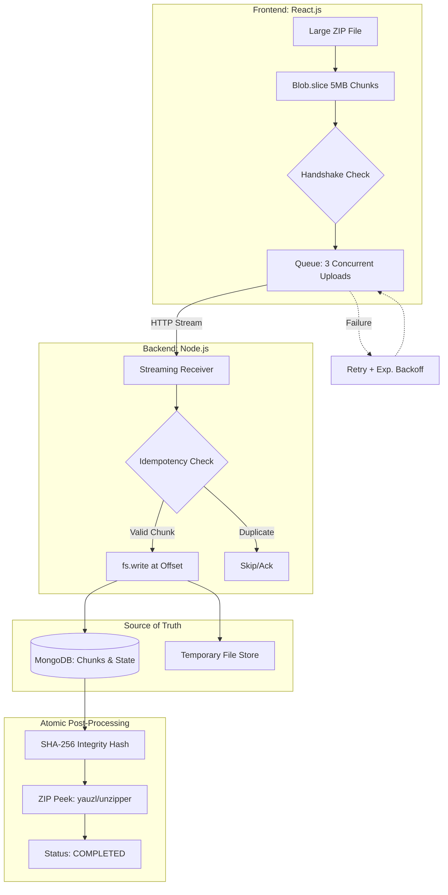

# **Fault-Tolerant Chunked File Uploader**

### Smart System for Resumable Large ZIP Uploads (>1GB)

A resilient web-based system that uploads very large ZIP files in small chunks, survives network failures, resumes uploads seamlessly, and processes files on the backend without crashing the server.

---

## **Overview**

Uploading very large files often fails due to unreliable networks, server restarts, or memory constraints.
This project implements a fault-tolerant upload pipeline using chunked uploads, database-backed distributed state, and streaming I/O to ensure uploads can resume safely without ever loading the full file into memory.

---

## **Tech Stack**

| Layer         | Technology        |
| ------------- | ----------------- |
| Language      | JavaScript        |
| Frontend      | React.js          |
| Backend       | Node.js (Express) |
| Database      | MongoDB           |
| File Handling | Node.js Streams   |
| Deployment    | Local / Cloud     |


---

## **Key Capabilities**

* 5MB chunk-based uploads using Blob.slice()
* Maximum 3 concurrent chunk uploads
* Database-backed pause and resume support
* Automatic retry with exponential backoff
* Global progress bar and per-chunk status grid
* Streaming file writes (no full file in memory)
* SHA-256 checksum generation for integrity verification
* ZIP inspection using streaming (no extraction)
* Periodic cleanup of abandoned uploads

---


### 🧩 System Architecture



### Explanation

* **Resilient Chunking:** React slices the ZIP into 5MB parts and uses a handshake to resume only missing chunks after a refresh.
* **Concurrency & Reliability:** Implements a strict limit of 3 concurrent uploads with exponential backoff to handle network flapping.
* **Memory-Efficient I/O:** Node.js uses streaming writes at specific byte offsets, ensuring constant low RAM usage regardless of file size.
* **Distributed State:** MongoDB tracks the lifecycle of every chunk, allowing the system to recover state after a server crash.
* **Secure Finalization:** Assembles the file atomically, performing a SHA-256 integrity check and "peeking" ZIP headers without extraction.

---

## Data Flow Diagram

```
User selects ZIP
        ↓
Frontend slices into chunks
        ↓
Handshake with backend
        ↓
Upload chunks (3 at a time)
        ↓
Retry failed chunks
        ↓
All chunks received?
        ↓
YES → Merge → Hash → ZIP Peek
        ↓
Mark upload COMPLETED
```

---

## Resume & Failure Flow

```
Upload in progress
        ↓
Network fails ❌
        ↓
State saved in DB
        ↓
User refreshes page
        ↓
Frontend fetches uploaded chunks
        ↓
Upload resumes from last chunk
```
---

## **Project Structure**

```
fault-tolerant-chunked-file-uploader/
│── frontend/               # React UI
│── backend/                # Node.js server
│── docker-compose.yml      # Container setup (optional)
│── README.md               # Documentation
```

---
## Trade-offs

- Docker Compose was not run locally due to OEM-enforced Virtualization-Based Security (VBS) on Windows 11 Home, which blocks Docker/WSL access to hardware virtualization despite it being enabled.
- MongoDB was used instead of MySQL as allowed alternative for faster iteration; the schema maps directly to the relational model described in the assignment.

---

## **Installation**

### **Prerequisites**

* Node.js 18+
* MongoDB
* npm

### **Setup Steps**

```bash
git clone <your-repo-url>
cd fault-tolerant-chunked-file-uploader
```

```bash
# Backend
cd backend
npm install
npm start
```

```bash
# Frontend
cd frontend
npm install
npm start
```
Frontend runs on http://localhost:3001  
Backend runs on http://localhost:3000


---

## **Fault Tolerance Scenarios**

* Network failures handled via retries and resume
* Out-of-order chunk delivery handled using offsets
* Duplicate chunk uploads safely ignored
* Server restarts recover state from database
* Double finalization prevented using atomic status checks

---

## **Future Enhancements**

* MySQL/PostgreSQL implementation
* Cloud object storage (S3/GCS)
* User authentication
* Download support
* React-based dashboard

---

## **Demo**

🎥 *Add demo video link here*
(Shows upload → network disconnect → resume → completion)

---

